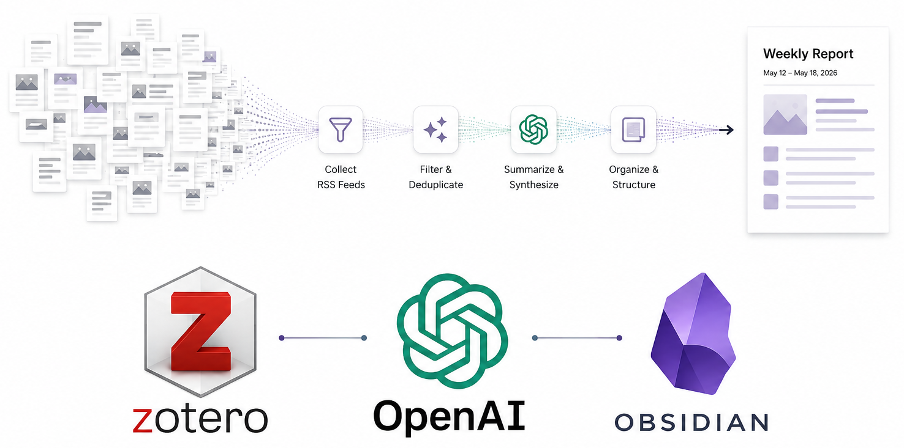

# RSS Article Digest


<div align="center">
  


</div>

A personal research assistant pipeline to fetch and curate recent scientific publications. It uses RSS feeds and OpenAI API to score recently published articles based on interests and generates a curated, ranked weekly digest to your email.

**Acknowledgements**: The idea for this project came from [this Reddit post](https://www.reddit.com/r/ObsidianMD/comments/1pmglpy/loving_obsidian_for_my_academic_literature/) by @jrcasey, describing how he used RSS feeds and LLMs to get a weekly email with articles ranked by interest. His original setup is at [jrcasey/RSS_Agent](https://github.com/jrcasey/RSS_Agent/tree/main), I recreated it to my needs: A simplified implementation but enhanced reports.

The "logo" was created using ChatGPT.


## How it Works

The pipeline is split across two GitHub Actions:

1. **Daily Fetch** (`fetch-daily.yml`, 08:00 UTC every day):
   - Fetches new articles from all configured RSS feeds.
   - Deduplicates them against the permanent seen-IDs log (Revised arXiv versions are treated as the same article during deduplication, so `v2`, `v3`, and later revisions do not reappear once the base paper has already been seen).
   - Appends new entries to the weekly cache. 

2. **Weekly Curation** (`weekly_rss.yml`, Monday 02:00 UTC):
   - Does one final feed fetch to catch any articles published since Sunday's daily run.
   - Uses OpenAI (GPT-4o-mini) to score every cached article against your research interests.
   - Generates a Markdown report (`output/RSS-feed_YYYY-MM-DD_YYYY-WNN.md`) of the top-ranked articles.
   - Emails the report to you as an attachment.
   - Resets the raw feed cache to `[]` for the next week.
   - Commits the updated cache state and the new report to the repo.


## Setup & Configuration

### Prerequisites

- Python dependencies listed in `requirements.txt`
- An OpenAI API key
- A GMAIL address to send the report (You will need an SMTP password that you can create following [this link](https://support.google.com/accounts/answer/185833).)

### Setup

If you're setting up your own fork (e.g., for different interests or email):

1. **Fork the repo** on GitHub
2. **Add the needed secrets** on GitHub (read more about [repository secrets](https://docs.github.com/en/actions/security-guides/using-secrets-in-github-actions)):
   - `GMAIL_EMAIL`: The sending email address
   - `GMAIL_APP_PASSWORD`: The SMTP app password mentioned above
   - `RECIPIENT_EMAIL`: The receiving email address
   - `OPENAI_API_KEY`: Your OpenAI API Key
3. Add the RSS feeds you want to follow in  **`config/feeds.json`**.

I won't lie, that's the annoying part: finding alive RSS feeds that match your needs.
Start by googling the journals/blogs/confs that you like and see if they also publish in RSS.
If you don't find anything try asking AI Agents for feeds, I realized that they are pretty good at finding links.
Obvious problem: they sometimes hallucinate the links.
So, try them once with `scripts/scratch.py` to see if the RSS feeds exist, are alive, and return what you want (sometimes the format might differ).
Once you have one, add it the `feeds.json` with the following format.

```json
{
  "feeds": [
    {"name": "ArXiv ML", "url": "https://rss.arxiv.org/rss/cs.LG"},
    {"name": "Another example", "url": "https://some-other-feed.xml"}
  ]
}
```

4. Customize your research interests used for sorting in **`config/interests.txt`** (this is injected directly into the AI ranking prompt).

You can be pretty verbose here (it's just gonna cost you a bit more). The key idea is to refine that prompt after the first reports. I found out that being quite explicit about you **don't** want to see in your reports is quite effective.

```text
Machine Learning, Robotics, Black Holes, Whatever You Fancy Really ...
```

### Going further

Feel free to adapt the report's format to your tastes in `scripts/generate_markdown.py`.
You can also open a PR here if you'd like to see a new feature 😊


## File Reference

### Configuration
Edit these to your usecase.

| File | Purpose |
| --- | --- |
| `config/feeds.json` | List of RSS feed URLs to follow (you can use `scripts/scratch.py` to try if feeds are still alive) |
| `config/interests.txt` | Natural-language description of your research interests, injected in the prompt |

### Cache
The cache is committed and managed by the pipeline.

| File | Purpose | Written by | Read by |
| --- | --- | --- | --- |
| `cache/raw_feeds.json` | Accumulates all new articles fetched during the week. Reset to `[]` each Monday after ranking. | `fetch_feeds.py` (appends) and weekly workflow (reset) | `rank_articles.py` |
| `cache/seen_ids.txt` | Permanent log of every article ID ever fetched, used to skip duplicates on future fetches. **Never cleared**. | `fetch_feeds.py` | `fetch_feeds.py` |
| `cache/ranked_articles.json` | Transient file (never committed) used during the weekly workflow to store top-scored articles. | `rank_articles.py` | `generate_markdown.py` |

### Output
The generated reports are stored by default, might be something to change in the future.

| File | Purpose |
| --- | --- |
| `output/RSS-feed_YYYY-MM-DD_YYYY-WNN.md` | Weekly curated digest, generated every Monday, committed to the repo, and emailed as an attachment. |

